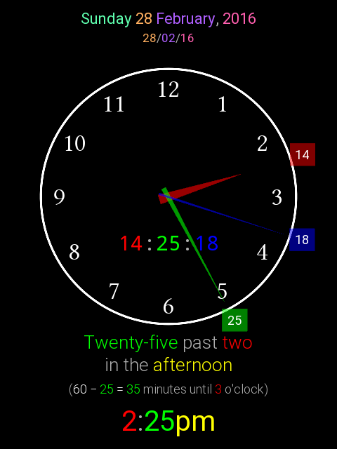
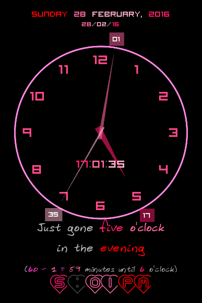
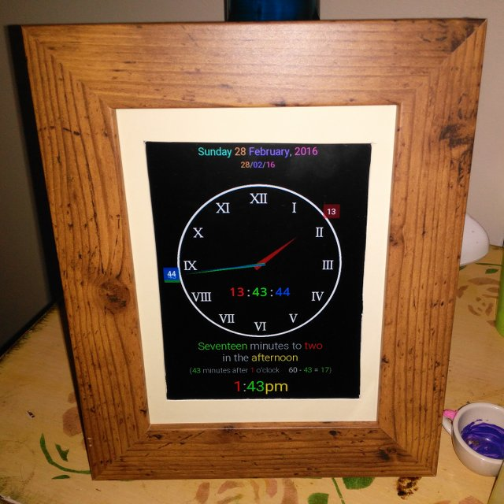

BKClock
=======

> **Copyright © 2016 Julian R Yon &lt;julian@julianyon.net&gt;**
> 
> This program is free software: you can redistribute it and/or modify it under the terms of the GNU General Public License as published by the Free Software Foundation, either version 3 of the License, or (at your option) any later version.
> 
> This program is distributed in the hope that it will be useful, but WITHOUT ANY WARRANTY; without even the implied warranty of MERCHANTABILITY or FITNESS FOR A PARTICULAR PURPOSE. See the GNU General Public License for more details.
> 
> You should have received a copy of the GNU General Public License along with this program. If not, see <http://www.gnu.org/licenses/>.

BKClock is a colour-coded clock to assist in teaching how to read the time. It was written using Python 3.4 and Kivy 1.9.0. It will probably work with other versions but that hasn't been tested. I wrote it for personal use, to run as a permanent installation on a Raspberry Pi Zero, and it works well enough for that purpose. So you won't find localisation, unit tests or any of the other polish of production-grade software. The code is clean, but not necessarily structured in an intuitive manner. **There is absolutely NO WARRANTY** and no offer of technical support is being made. As noted above, the code is made available under the GNU GPL v3 or later.

As a concession to proper software engineering practice, some basic customisation is possible without having to hack the code. Having two autistic kids I know how attached they can get to their favourite colours! So open up `config.py` in your editor; the comments will guide you. The colour entries are `(red, green, blue)` triples. If you don't think in RGB, open up a paint program and play with the colour selector. It is also possible to choose the fonts used and some other minor options.

For convenience, in case you do not already have a local copy of the files used by the example configuration, a fonts directory is included in the distribution. These files are not a part of the application and have not been modified in any way. Many popular free operating systems include them, and you may use your system fonts instead by specifying the correct path to them. *Copyright notices and licensing conditions can be found in the individual font directories*. They were downloaded from the following locations which were live as of 23/03/2016:

* Roboto & Droid Sans Mono:
  https://android.googlesource.com/platform/frameworks/base/+/lollipop-release/data/fonts/

* Linux Libertine:
  https://sourceforge.net/projects/linuxlibertine/files/linuxlibertine/5.3.0/

---

